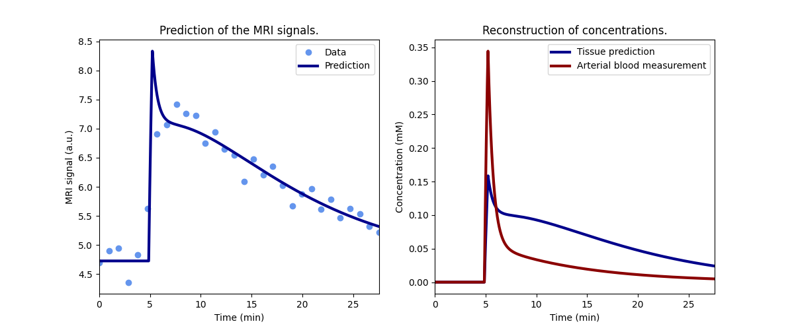

---

# Measuring drug-mediated inhibition of liver transporters in rats

[](https://www.apache.org/licenses/LICENSE-2.0) [](https://creativecommons.org/licenses/by/4.0/) [](https://doi.org/10.5281/zenodo.15609209) [](https://doi.org/10.5281/zenodo.15610261) [](https://doi.org/10.5281/zenodo.15610350)

## 📚 Context 

The liver is responsible for filtering waste products from the blood, and evacuating these by excreting them to bile. Drugs commonly affect these procesesses, potentially leading to toxic side effects.

If a drug inhibits excretion into the bile, then harmful material can get stuck in liver cells and cause damage to the liver. This is commonly referred to as drug-induced liver injury (DILI). If a drug on the other hand blocks the uptake of these materials into the liver, they will circulate in the blood for too long and may cause harm elsewehere.

When dealing with novel drugs, either in basic research or drug development, it is often unknown to what extent a drug affects the uptake or excretion into the liver. This can expose trial participants to significant risk, or even patients in clinical practice if the risk is not identified during development.

In order to mitigate these risks, the [TRISTAN project](https://www.imi-tristan.eu/) developed an MRI-based method to measure the effect of drugs in liver transporters directly. Proof of concept was provided in preclinical studies and pilot studies in humans, showing that the method is able to detect inhibition of uptake and excretion caused by drugs. 

The pipeline in this repository was used to generate the results in humans. It can be used to reproduce them independently, but also to analyse new data acquired in the same way. 

## 🛠️ What does it do? 

The **inputs** to the pipeline are signal-time curves in regions-of-interest in the liver, using a dynamic gadoxetate-enhanced MRI acquisition, of any number of rats. The data must be in .dmr format as in [this repository](https://doi.org/10.5281/zenodo.15610261).

The **outputs** are measurements of gadoxetate uptake rates into hepatocytes, and excretion rates into bile. Key numerical results from the TRISTAN studies are saved in [this database](https://doi.org/10.5281/zenodo.15610350).

Apart from the main biomarkers, the pipeline creates plots for visual checking of individual results.

## 	📄 Code structure

The **src** folder contains all the source code, with the top level entry scripts, which call on functions in the subfolder **methods**.

The **build** folder contains the output produced by the scripts in **src**. It can be deleted and will be recreated by the scripts. The output of the script **tristan.py** is included in this repository as an example. It has the following substructure:

- **Inputs**: Datasets with signal-time curves downloaded from the [data repository](https://doi.org/10.5281/zenodo.15610261).
- **Outputs**: Numerical values for all subjects and all scans, summarised as one dmr file per study. These files have been uploaded to [this database](https://doi.org/10.5281/zenodo.15610350) for further analysis.
- **Results**: One folder per study containing more detailed single-subject results: numerical values per subject and per scan, and plots per subject and per scan to check for goodness-of-fit.

## 💻 Usage

The pipeline can be run after installing the requirements:

```console
pip install -r requirements.txt
```

The main scripts are in **src** and can be run independently. The script **src/tristan.py** reproduces the results generated in various studies during the TRISTAN project, and which have been secured in [this database](https://doi.org/10.5281/zenodo.15610350). The script **src/newdrug.py** can be used to generate results for a new drug.

In order to reproduce existing results, delete the **build** folder and run the script **tristan.py**. The pipeline will download its input data from [a public archive](https://zenodo.org/records/15301607). The local copy of the data is deleted after completion of the analysis. 

In order to analyse a new drug with the same method, perform the following steps:

1. Acquire data as laid out in the [experimental protocol](https://www.imi-tristan.eu/liver) and derive signal-time curves (miblab pipeline for this part coming soon).

2. Save your data in [dmr format](https://openmiblab.github.io/pydmr/format.html) in the same way as the datasets on [the public archive](https://zenodo.org/records/15301607).

3. Then run the script **newdrug.py** making sure to replace the placeholder values by those that describe your data. When the computation finishes, the results will be added to the build folder.

## ❤️ Citation 

Melillo N, Scotcher D, Kenna JG, Green C, Hines CDG, Laitinen I, Hockings PD, 
Ogungbenro K, Gunwhy ER, Sourbron S, et al. Use of In Vivo Imaging and 
Physiologically-Based Kinetic Modelling to Predict Hepatic Transporter 
Mediated Drug–Drug Interactions in Rats. Pharmaceutics. 2023; 15(3):896. 
`[DOI] <https://doi.org/10.3390/pharmaceutics15030896>`_ 

## 👥 Contributors

<!-- ALL-CONTRIBUTORS-LIST:START - Do not remove or modify this section -->
<!-- prettier-ignore-start -->
<!-- markdownlint-disable -->
<table>
  <tbody>
    <tr>
      <td align="center" valign="top" width="14.28%"><a href="https://github.com/EShalom"><br /><sub><b>Eve Shalom</b></sub></a><br /></td>
      <td align="center" valign="top" width="14.28%"><a href="https://github.com/plaresmedima"><br /><sub><b>Steven Sourbron</b></sub></a><br /></td>
    </tr>
  </tbody>
</table>
